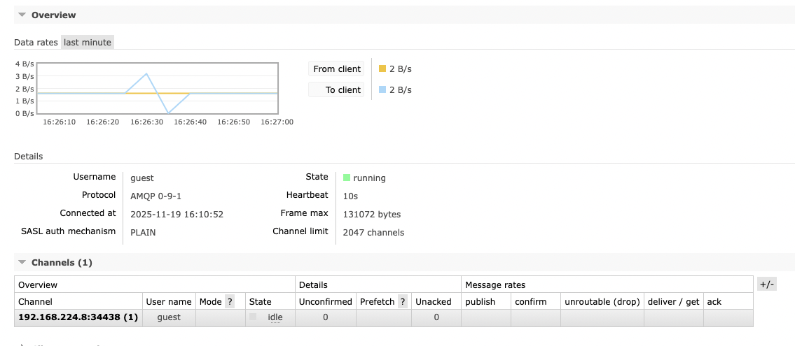
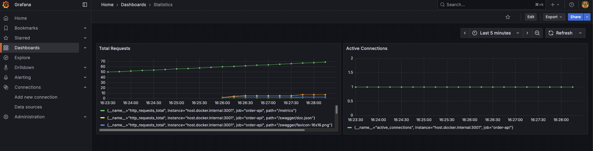
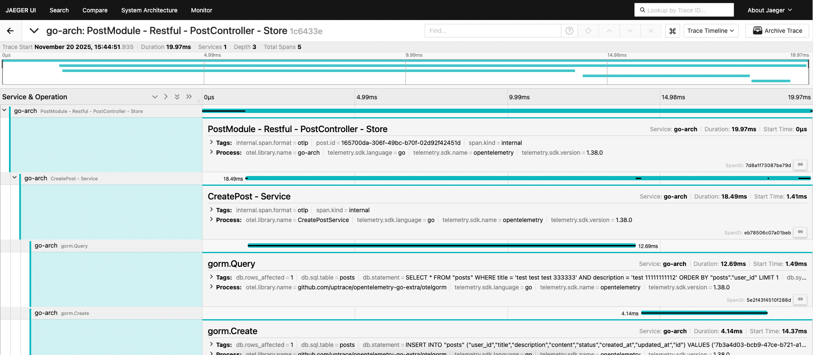
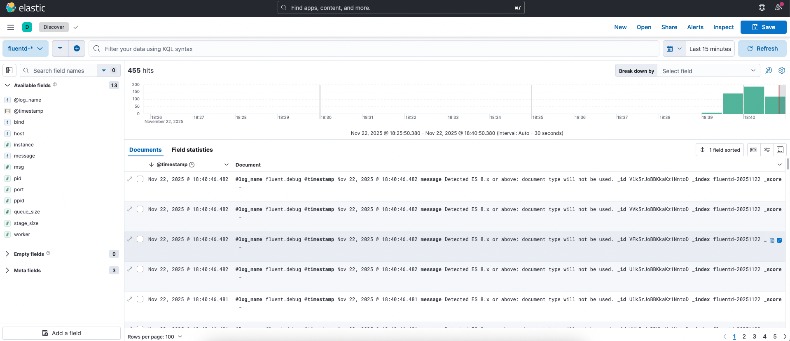

<p align="center">
  <a href="https://goreportcard.com/report/github.com/racibaz/go-arch">
    
  </a>
  &nbsp;
  
  &nbsp;
  
  &nbsp;
  
</p>

# Go-Arch
Hexagonal Architecture, Domain Driven Design (DDD), Test Driven Design (TDD), RESTful, gRPC, Swagger, Gorm(PostgreSQL), Notification(Twilio), RabbitMQ, Prometheus, Grafana, Jaeger, Elasticsearch, Kibana and Gin in Golang

## 📖 Overview
This project demonstrates clean architectural principles in Go, including:

- **Hexagonal Architecture** for separation of concerns
- **DDD** for domain modeling
- **TDD** for reliable, testable code
- **RESTful APIs** 
- **gRPC APIs**
- **Swagger UI** for API exploration
- **PostgreSQL with Gorm ORM**
- **RabbitMQ** for messaging
- **Prometheus** for metrics
- **Grafana** for visualization
- **OpenTelemetry** for tracing
- **Jaeger** for distributed tracing
- **Twilio** for notifications
- Graceful Shutdown
- Configuration Management
- **Logging** with Zap
- Docker and Docker Compose
- **Live Reload** with Air
- **Database Migrations** with Golang-Migrate
- **Mocking** with Mockery
- Comprehensive Documentation
- **Makefile** for common tasks
- **Postman Collection** for API testing
- **EFK Stack** for logging


## Notes
- There are two config files that are .env and config.yaml. You can override config.yaml values with environment variables defined in the .env file.
- You can use two ways to run database migrations:
    1. Using golang-migrate package via Makefile commands.
       The Command examples:
        - name=init_schema make db_create_migration
        - make db_migrate_up
        - make db_migrate_down
        - make db_migrate_force
        - make db_migrate_drop
        - make db_migrate_version
    2. Using the `cmd/migrate` CLI application provided in the project.
       The Command example:
        - make migrate


### Run with Docker (air for live reload)
```bash
docker compose up --build

docker exec -it Blog-app sh

make db_migrate_up
```

### Makefile Commands
```bash
make run
```
```bash
make migrate
```
```bash
name=init_schema make db_create_migration
```
```bash
make db_migrate_up
```
```bash
make db_migrate_down
```
```bash
make db_migrate_force
```
```bash
make db_migrate_drop
```
```bash
make db_migrate_version
```
```bash
make seed
```
```bash
make mock
```

## Project Structure

Minimal Structure

```lua
├── Dockerfile
├── LICENSE
├── Makefile
├── README.md
├── cmd
├── config
├── deployments
├── docker-compose.yml
├── docs
├── entrypoint.sh
├── go.mod
├── go.sum
├── internal
│   ├── database
│   │   ├── migration
│   │   └── seeder
│   ├── modules
│   │   ├── post
│   │   │   ├── application
│   │   │   ├── domain
│   │   │   ├── infrastructure
│   │   │   ├── module.go
│   │   │   ├── presentation
│   │   │   └── test
│   │   └── shared
│   │       ├── domain
│   │       ├── infrastructure
│   │       └── presentation
│   └── providers
├── main.go
├── migrations
├── pkg
```

Expanded Structure

```lua
├── cmd
├── internal
│   ├── database
│   │   ├── migration
│   │   └── seeder
│   ├── modules
│   │   ├── post
│   │   │   ├── application
│   │   │   │   ├── commands
│   │   │   │   ├── dtos
│   │   │   │   ├── handlers
│   │   │   │   ├── ports
│   │   │   │   └── queries
│   │   │   ├── domain
│   │   │   ├── infrastructure
│   │   │   │   ├── messaging
│   │   │   │   │   └── rabbitmq
│   │   │   │   ├── notification
│   │   │   │   │   └── sms
│   │   │   │   └── persistence
│   │   │   │       ├── gorm
│   │   │   │       │   ├── entities
│   │   │   │       │   ├── mappers
│   │   │   │       │   └── repositories
│   │   │   │       └── in_memory
│   │   │   ├── module.go
│   │   │   ├── presentation
│   │   │   │   ├── grpc
│   │   │   │   │   └── proto
│   │   │   │   ├── http
│   │   │   │   │   ├── reponse_dtos
│   │   │   │   │   └── request_dtos
│   │   │   └── test
│   │   │       └── integration
│   │   └── shared
│   │       ├── domain
│   │       ├── infrastructure
│   │       └── presentation
│   └── providers
├── main.go
├── migrations
├── pkg
│   ├── bootstrap
│   │   ├── migrate.go
│   │   ├── seed.go
│   │   └── serve.go
│   ├── config
│   ├── database
│   ├── ddd
│   ├── env
│   ├── error
│   ├── es
│   ├── grpc
│   ├── helper
│   ├── logger
│   ├── messaging
│   ├── notification
│   ├── prometheus
│   ├── registry
│   ├── routing
│   ├── trace
│   ├── uuid
│   └── validator


```

#### Generate gRPC Code
```bash
make generate_proto
```

### Swagger Documentation UI
`http://127.0.0.1:3001/swagger/index.html#`

#### Generate Swagger Documentation
```bash
  make generate_swagger
```


### RabbitMQ UI
`http://localhost:15672/#/`

#### Username: guest
#### Password: guest




### Prometheus UI
#### `http://localhost:9090/`
#### `http://localhost:3001/metrics`


### Grafana UI
`http://localhost:3002/login`

#### Username: admin
#### Password: admin



### Jaeger UI

`http://localhost:16686/search`



### Elasticsearch
`http://localhost:9200/`


### Kibana UI
`http://127.0.0.1:5601/app/home#/`




## Dependencies
- uuid: `github.com/google/uuid`
- cli: `github.com/spf13/cobra`
- config: `github.com/spf13/viper`
- framework: `github.com/gin-gonic/gin`
- protobuf: `github.com/golang/protobuf`
- grpc: `google.golang.org/grpc`
- grpc-gen: `google.golang.org/genproto/googleapis/rpc`
- orm: `gorm.io/gorm`
- live reload: `github.com/air-verse/air`
- open api: `github.com/swaggo/swag`
- open api gin: `github.com/swaggo/gin-swagger`
- testing: `github.com/stretchr/testify`
- mocking: `github.com/vektra/mockery`
- logger: `github.com/uber-go/zap`
- twilio: `github.com/twilio/twilio-go`
- rabbitmq: `github.com/rabbitmq/amqp091-go`
- migrations: `github.com/golang-migrate/migrate/v4`
- prometheus: `github.com/prometheus/client_golang`
- open telemetry: `go.opentelemetry.io/otel`
- jaeger: `go.opentelemetry.io/otel/exporters/jaeger`


## 🛠 Roadmap / TODO

- [ ] Add more unit tests
- [ ] Add more integration tests
- [ ] Add more end-to-end tests
- [ ] Extend documentation
- [ ] Add GraphQL API
- [ ] Add more gRPC services
- [ ] MongoDB integration
- [x] Grafana & Prometheus integration
- [x] OpenTelemetry & Jaeger integration
- [x] Tracing with Jaeger
- [ ] Add correlationId support
- [ ] GitHub Actions Workflow for CI/CD
- [x] EFK Stack for logging
- [x] Single environment (override config.yaml file with .env file)
- [ ] Add Auth Module 
- [x] Alternative migration usage with cmd/migrate CLI app and golang-migrate package
- [ ] Kubernetes deployment manifests
- [ ] Helm charts for easy deployment
- [ ] Support for more notification channels (e.g., Email, Push Notifications)
- [ ] Implement rate limiting
- [ ] Implement API versioning
- [ ] Implement feature toggles


## 📬 Postman Collection
[Download](docs/postman/baz-arch.postman_collection.json)

## Validation Error Example
When sending a POST request to create a post with invalid data, you might receive a validation error response like this:
```
{
    "type": "validation error",
    "message": "post validation request body does not validate",
    "cause": {
        "Content": [
            "min"
        ],
        "Description": [
            "min"
        ],
        "Title": [
            "min"
        ]
    }
}

```


## Linters
```bash
go vet ./...
```

## Test

```bash
go test -v ./...
```
```bash
go test -v -cover ./...
```


## Code of Conduct

Please note that this project is governed by a [Code of Conduct](CODE_OF_CONDUCT.md). By participating, you are expected to uphold this code.

## Contributing

Please see the [CONTRIBUTING](CONTRIBUTING.md) file.

## License

This project is licensed under the Apache 2.0 License. For further details, please see the [LICENSE](LICENSE) file.
